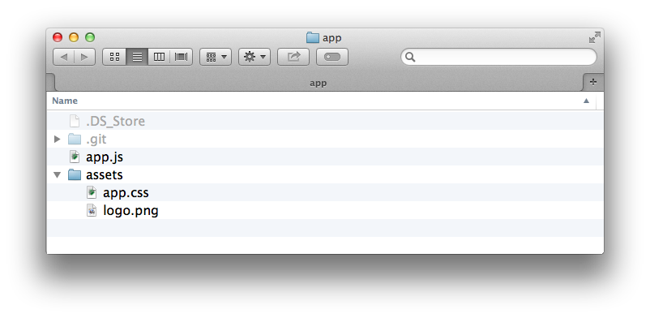
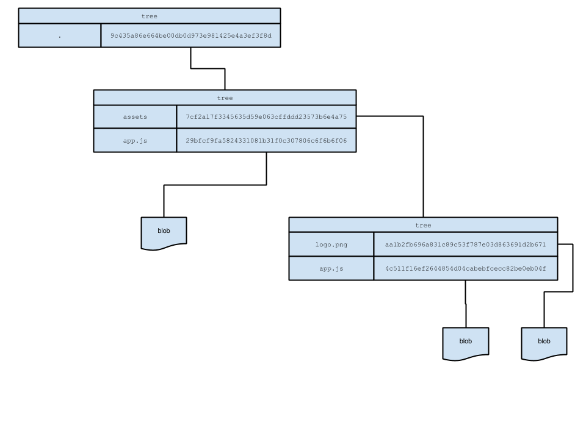

{mainmatter}

# Understanding commits in Git

The book's goal is to give you a deep understanding of what rebasing in Git is, how it works and what it does. In order to understand all that, it is essential to get a picture of what a commit looks like and how Git deals with its data on a file system level.

The first thing we are going to do is to take a closer look at the anatomy of a commit in Git and learn the low level building blocks that assemble it. Then, we are also going to look into what those weird hashes consisting of numbers and characters, that Git apparently produces quite often, are all about. Once we learned that, we are going to learn that all the operations Git does are actually super trivial and it's also going to be a lot easier to follow things that happen during our daily usage of it. But first, let's start with the long revision names we were talking about.

## What's up with those long revision names?

One of the first things people notice when they switch from other version control systems to Git, is that revisions use hard to remember 40 characters long hashes. They are pretty much impossible to read and also look quite cryptic, especially when they appear the very first time on the screen. Let's generate one of those hashes real quick, just to make sure we're all on the same page.

{title="Creating a first commit",linenos=off,lang="sh"}
    $ mkdir app && cd app && git init
    $ echo "foo" >> foo
    $ git add foo
    $ git commit -m "adds foo"

Running the commands above in a dedicated terminal creates a new folder `app`, initializes an empty Git repository in it, and finally adds and commits a file `foo` to it. If we now run `git log` to see the history of our commits that are reachable from the currently checked out branch, we see something like this:

{title="Logging commit data",linenos=off,lang="sh"}
    commit f4f78b319c308600eab015a5d6529add21660dc1
    Author: Pascal Precht <pascal@thoughtram.io>
    Date:   Sat Nov 29 00:06:08 2014 +0100

        adds foo

There it is. We have a commit hash that says `f4f78b319c308600eab015a5d6529add21660dc1`. So what is it that causes these long hashes that don't seem to mean anything for us humans? And why do we need them at all and not just use revision names such as `r4711` or `r4712`?

It turns out that using 40 bytes long hashes is actually pretty clever. Of course, they are hard to read and even harder to remember, but they were also not necessarily made for humans in the first place. These hashes are used by Git to make the data we are working with **addressable** on a file system level. Not only that, but they also ensure our data is cryptographically secure. Git comes with integrity by default.

If you and me both look at revision `f4f78b319c308600eab015a5d6529add21660dc1` on our machines and Git tells us that we have a clean working directory, we can be 100% sure that we are looking at exactly the same files. There is no way someone could manipulate a single bit without Git knowing about it.

This is especially important in a distributed version control system,  because in that way, there's no chance that bits could go lost in transit without Git noticing it.

Okay, we now know that these hashes somehow ensure that our data isn't broken, corrupted or manipulated, and that Git is able to use them to address data in our file system (however that even works). However, Git surely doesn't randomly choose a couple of numbers and characters and put them together as a hash to work and rely on that right? So where do these hashes come from and what meaning do they have?

## Introducing SHA-1 

Those 40 character revision identifiers are actually so called SHA-1 hashes. SHA-1 is an algorithm that takes some data as input and generates a unique 40 character string from it. But what does *unique* mean in that context? Unique means that **no other** input data should ever produce the same hash. However, **the same** input data should always produce exactly the same hash. So if we generate a SHA-1 hash from a string `thoughtram` and do it again another time, the resulting hash looks exactly the same as in the first run.

I> SHA-1 is an algorithm that generates unique 40 character strings.

On a UNIX system, we can simply try that out by running the following command in a terminal:

{title="Generating a SHA-1 hash from a string",linenos=off,lang="sh"}
  echo -n "thoughtram" | openssl sha1

This should print out the hash `a9eb85ea214a6cfa6882f4be041d5cce7bee3e45` no matter if we run it on your machine or on mine. It's the SHA-1 representation of the string `thoughtram`. Okay, this made things a bit more clear, but when looking at the hash we're getting, it's not quite the same when we write the string to a file and commit it to a Git repository, right? That's because there's more happening behind the scene and we'll shed some light into that particular darkness now.

## Hashes over hashes

Just hashing a string is, of course, not enough. As we know, the same string always returns the exact same hash. So assuming Git would just use a hash of a simple string for its commits, that would conflict in no-time since there'll be cases (especially when working with code), where the same string appears more than once.

Git needs more data to make each commit actually unique. Let's take a look at a very abstract presentation of what the implementation of a `git commit` command looks like and iterate on it until we have a strong understanding of the internal representation. In principle it looks like this in pseudo code:

{title="Pseudo code representation of Git's commit command",linenos=off,lang="sh"}
    sha1(
        metaData
            commitMessage,
            committer,
            commitDate,
            author,
            authoringDate
        ,
        hashOfWorkingDirectory
    )

What this pseudo code shows, is that a commit is a SHA-1 hash consisting of two things: 

- **The commit meta data** - Which is the commit message, the committer, a commit date, the author and an authoring date of the commit.
- **Another hash** - That represents a snapshot of our entire working directory, which means all of its folders and files recursively.

It may not become clear up front, but let that sink in for a second. A commit is a hash over some meta data and another hash based on the current working directory.

Now we know what a commit object is made of, but it's still not clear where the hash for the current working directory comes from. In order to get a picture of that, we have to take a look at the different object types that Git deals with.

## Meet the tree object

Git knows about four different types of objects:

- Blobs
- Trees
- Commits
- Annotated Tags

Only three of them are essential to create actual commits and commit histories, these are the blobs, the trees and the commit objects. We take a deeper look at them one by one and start with the tree object.

When I said `hashOfWorkingDirectory` I made a bit of an oversimplification. Yes it's true, it's a hash over the entire working directory with all its files and folders excluding ignored files. But at the same time it's not quite *that* simple. Let's assume the following project structure and then examine how it is represented with the corresponding tree object.

This project structure is a Git repository, which is why we can see a `.git` folder. Beside that it has an `assets` folder where we can find media files and stylesheets. And last but not least, we have a `app.js` file next to the `assets` folder, that probably has our actual application logic.

Now let's take a look at what Git's representation of this working directory looks like:

Okay, so that looks quite cryptic at a first glance. What we see here is Git's representation of our sample folder in a kind of abstracted way to make it easier to visualize how it stores its data. Let's take a deeper look, beginning with the blobs. "Blob" is an acronym for **Binary Large Object**. A blob represents raw data without any association to anything. That means, a blob doesn't even have a file name - it's really just the pure data.

Taking a look at the figure we can see that each file is stored as a blob. But what exactly does that mean? Let's keep things simple and just assume that Git generates the SHA-1 hash of the contents of `logo.png` and puts it somewhere addressable as `aa1b2fb696a831c89c53f787e03d863691d2b671`. It also generates the SHA-1 hash of the contents of `app.css` and puts it somewhere addressable as `4c511f16ef2644854d04cabebfcecc82be0eb04f`. Same goes for the `app.js` file. Now there's a hash for all files that we have. However, notice that at this point there's no connection between the file name `logo.png` and the hash `aa1b2fb696a831c89c53f787e03d863691d2b671`. This is done on a higher level for good reasons.

Both `logo.png` and `app.css` are in the same directory `assets`. This directory is represented as a **tree object** (represented as rectangles in the figure). You can think of The tree object as a dictionary that maps (file) names to SHA-1 hashes. And behind those hashes, there may be simple files (represented as blobs) or even other tree objects.

So we can see that in our example it maps the name `logo.png` to the hash `aa1b2f...` and the name `app.css` to the hash `4c511f...`. Eventually the tree object itself is also hashed and represented by the SHA-1 hash `7cf2a1...`.

But we aren't done yet. Both, the `assets` folder and the `app.js` file, are in the same directory. It's the top level directory and again it works like a dictionary. It maps the name `assets` to the hash `7cf2a1...` (the child tree object!) and the name `app.js` to the hash `29bfcf...`. And then again the dictionary itself is also hashed and becomes the root tree object with hash `9c435a...`.

Wow, that was complicated, wasn't it? Don't be scared by all these hashes, what counts is the principle. Let that sink in again, `9c435a...` is the hash of the root tree object which essentially translates into a dictionary that maps names to hashes and those hashes can refer to blobs (for files) or other tree objects which in turn are dictionaries themselves that map names to hashes which can refer to...ah well, you get the idea.

## The commit object

Now that we have a basic idea of how Git represents its data in blobs and trees, we can go back to our commit object from above and fill it with life. Let's assume we freshly started the repository and this is our initial commit. What follows is again pseudo code to demonstrate what exactly is used to get to the commit hash.

{title="Pseudo commit command",linenos=off,lang="sh"}
    sha1(
        metaData
            commitMessage => "initial commit",
            committer => Christoph Burgdorf <christoph@thoughtram.io>,
            commitDate => Sat Nov 8 10:56:57 2014 +0100,
            author => Christoph Burgdorf <christoph@thoughtram.io>,
            authorDate => Sat Nov 8 10:56:57 2014 +0100
        ,
        hashOfWorkingDirectory => 9c435a86e664be00db0d973e981425e4a3ef3f8d
    )

It's all the meta data plus the hash of the root tree object. And of course Git creates a SHA-1 hash from those contents. The commit hash.

Remember we mentioned Git has integrity? You can't change a single thing about this commit without getting a different SHA-1 commit hash. Want to change the commit message? The commit message is part of the content that is used to produce the SHA-1 hash, changing it will change the commit hash. What if we just add a whitespace somewhere in `app.css`? Doesn't matter. The SHA-1 hash of `app.css` won't be `4c511f...` anymore and that in turn will cause the `assets` tree object to not be `7cf2a1...` anymore and that in turn will cause the root tree object to not be `9c435a...` anymore. That's integrity.

## Summary

Congratulations! We now know how Git handles the data that we commit to our repositories. We've learned that these cryptic hashes are SHA-1 hashes, to make data addressable. We've also learned that Git creates a hash over all contents as blobs and folders as trees recursively to finally create another hash of that data, along with some meta data to create actual commit objects. And because everything is hashed from the ground up, we know that we can't change anything without Git knowing it.

Please note that we simplified some parts intentionally in order to reduce the noise and make the essence easier to grasp. If you like to dig deeper, we highly recommend to read up on the Git's internals in the [Git book](http://git-scm.com/book/en/v2/Git-Internals-Git-Objects).

In the next chapter we take a look at merges and get a basic understanding of what three-way and fast-forward merges are.
